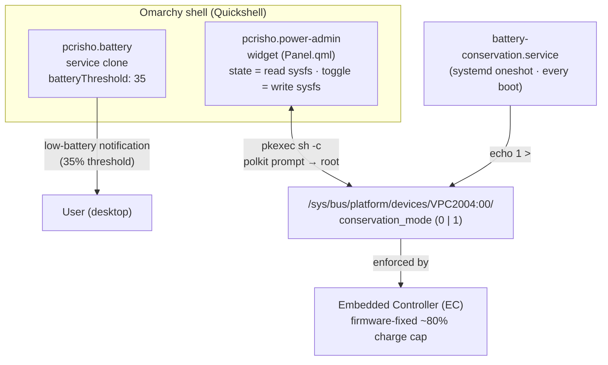

# Architecture

## Components

### 1. Widget (`Panel.qml` in `pcrisho.power-admin`)

- Reads `conservation_mode` every `refreshInterval` (30s) → shows `󰂅`
  (limit on) or `󰁹` (full charge).
- Left click → `pkexec sh -c "echo 0|1 > .../conservation_mode"` → polkit
  prompt → root write to sysfs.
- Right click → panel with battery % (from UPower via the battery service),
  status, and explicit `Limit to 80%` / `Full charge` buttons.
- Exposes the IPC target `pcrisho.power-admin` (`state`, `toggle`,
  `setLimit`).

### 2. Persistence (`battery-conservation.service`)

Systemd oneshot (enabled) that writes `1` to `conservation_mode` on every
boot, so the battery stays protected even after a full reboot regardless of
the widget state. The widget toggle therefore only lasts until the next
reboot — by design.

### 3. Notification threshold (`pcrisho.battery`)

Clone of Omarchy's first-party battery service with `batteryThreshold`
changed from 10 → 35. Being a *clone* (not a patched original) means Omarchy
updates never overwrite the threshold, at the cost of the clone not
receiving upstream improvements (see KNOWN-ISSUES).

`omarchy.battery` is disabled in `shell.json`; the clone is the active
service.

## Data flow for a toggle

1. User clicks the widget icon.
2. `Panel.qml` flips its local state and calls `pkexec`.
3. Polkit agent shows the prompt; on success the command writes 0/1 to
   `conservation_mode` as root.
4. The EC enforces the cap at ~80% (firmware value, not software).
5. The widget re-reads the attribute (immediately + every 30s) and updates
   the icon.
6. On boot, `battery-conservation.service` re-applies `1`.